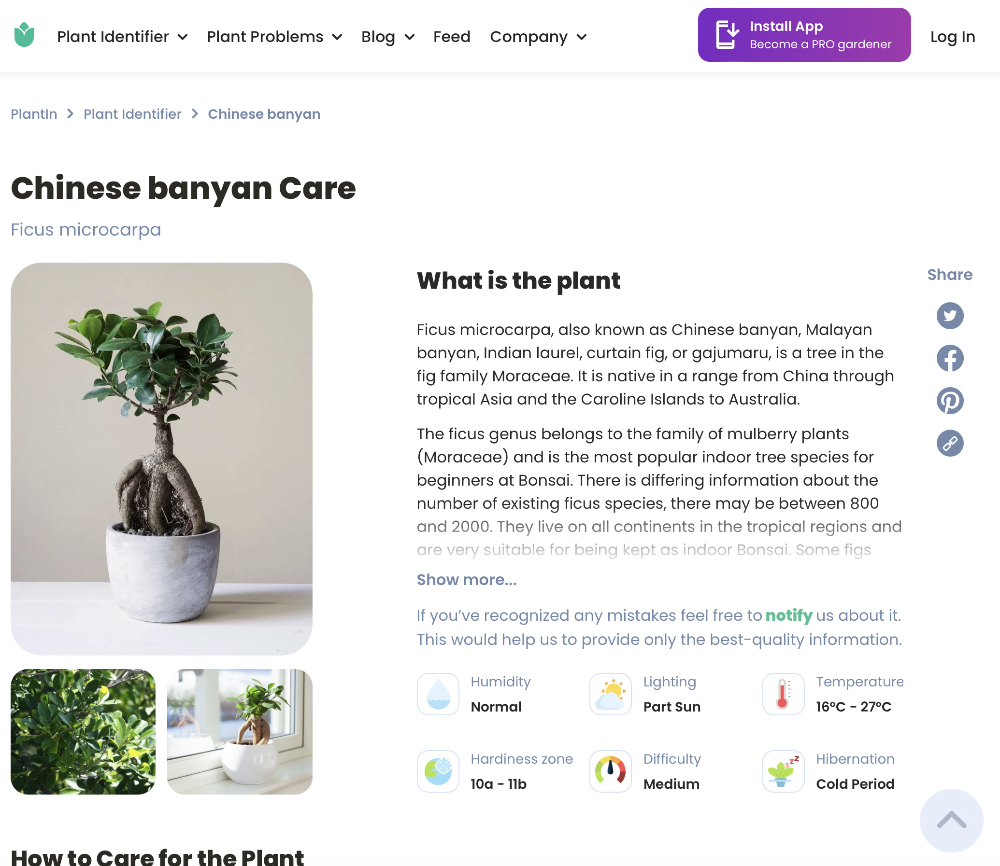
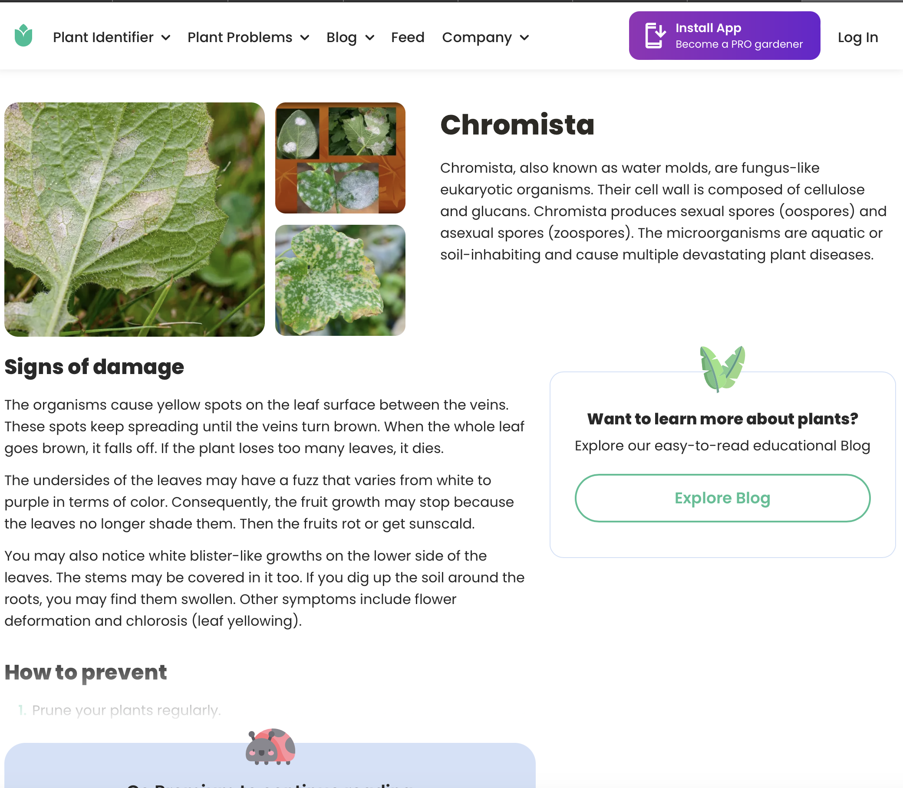
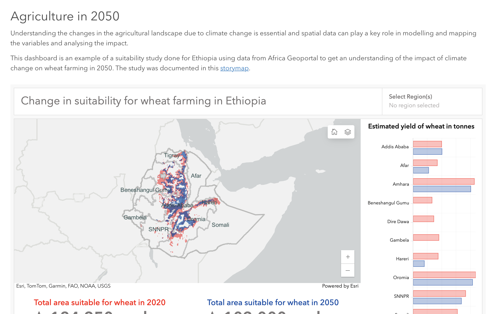

# AgriLens: Optimizing Crop Management for Growers and Researchers

**Tailored UI/UX Design for Simplified Plant Care and Advanced Data Analysis**

## Overview

AgriLens is designed to cater to both food cultivators and researchers with tailored UI and UX experiences. Our goal is to provide an intuitive interface for growers and a data-rich, professional platform for researchers to analyze crop health, pest and disease impact, and climate conditions. 

- **For Growers**: A clean, simple, and intuitive UI that offers essential plant health information, proactive care suggestions, and composting recommendations.
- **For Researchers**: A more professional, data-driven UI that allows for deeper analysis of data collected from growers, combined with other resources, to provide insights on optimizing crop yield with a focus on environmental sustainability.

## Design Goals

1. **Grower Interface**:
    - Clean and minimalistic UI
    - Easy-to-navigate UX
    - Proactive care suggestions for plant health
    - Composting recommendations for plants beyond recovery

2. **Researcher Interface**:
    - Professional, data-centric UI
    - Text-heavy with detailed data analysis
    - Easy access to aggregated data from growers
    - Insights into disease, pests, and climate factors
    - Focus on sustainability and optimizing yield

## Website Design Ideas

- **Home Page**: 
    - Brief introduction to AgriLens and its purpose.
    - Two prominent call-to-action buttons: one for growers, one for researchers.
    - A section highlighting the benefits of data-driven plant care and research collaboration.

- **Grower Dashboard**:
    - A clean layout that emphasizes easy-to-read information about plant health.
    - Suggestions for proactive care, such as watering, fertilization, or pest control.
    - Composting recommendations if the plant is beyond recovery.

- **Researcher Dashboard**:
    - A more data-rich design with graphs, charts, and extensive text to present findings.
    - Aggregated data from various sources, including growers.
    - Ability to filter data by region, plant type, and specific conditions like disease or pest infestations.
    - Tools for deep analysis, such as disease prediction models and climate impact reports.

## Inspiration

The inspiration for the AgriLens design is divided into two primary user groups: **Growers** and **Researchers**. Each group requires a tailored approach to UI/UX, drawing from different sources of inspiration.

### Growers

**Desired Features**

1. **[PictureThis](https://www.picturethisai.com)**:  
    - Clean and straightforward UI for immediate access to key functions.
    - Instant photo upload for plant identification, simplifying the user experience.
    - Minimal distractions, focusing on the task of identifying plants and providing actionable insights.

2. **[PlantIn](https://myplantin.com/plant-identifier)**:  
    - The page prominently identifies plant issues (e.g., "Chromista" or "Chinese banyan Care") with a large, clear image at the top.
    - This helps users immediately recognize the subject matter.
    - Brief, informative descriptions of the plant or the issue are given in a concise manner.
    - Users can quickly understand what they are looking at without being overwhelmed by too much text.
    - Important features like "Humidity", "Lighting", "Temperature", "Hardiness zone", etc., are represented with icons and short text to visually simplify the data.

**Color Guidance**

1. **[Coolors Color Palettes](https://myplantin.com/plant-identifier)**:  
    - A natural color palette focusing on greens and earth tones, evoking sustainability and plant health.
    - Warm, inviting colors to create a friendly and approachable feel for everyday users.
    - Bright accent colors for key notifications or action items like care suggestions.

**Typography**

1. **[Typography Guidance](https://myplantin.com/plant-identifier)**:  
    - Sans-Serif Fonts: simplicity and readability, especially on screens, making them ideal for both body text and headers.
    - Headings: bold and larger in size, providing a clear hierarchy that draws the user’s attention to important sections (e.g., "Chromista", "Chinese banyan Care").
    - Body: The body text is kept in a simple, highly readable sans-serif font that is not overly compact or crowded, ensuring easy readability even in longer paragraphs.

### Screenshots for Researchers

---

### Researchers

#### Desired Features

1. **[Data-Rich Dashboards](https://agriculture.africageoportal.com)**:
    - The researcher interface includes data-heavy sections for monitoring and forecasting agricultural production. The use of real-time data streams (e.g., Earth observations, agribusiness data, and field data) is critical for decision-making.
    - Features like performance dashboards for field operations can enhance data collection, allowing for better crop inspections, pest monitoring, and understanding the impacts of adverse weather events.

2. **[GIS Integration](https://agriculture.africageoportal.com)**:
    - GIS tools: are prominently used to improve field efficiency by providing spatial data for mapping crop health. This allows researchers to monitor and predict issues in real-time.
    - Geospatial data layers: offer insights into larger trends and impacts on agriculture, enabling more effective management of large farming regions.

3. **[Sustainability Focus](https://agriculture.africageoportal.com)**:
    - The researcher dashboard emphasizes improving sustainable agricultural practices to contribute to long-term food security. Researchers can analyze data to forecast production and monitor the environmental impact of agricultural activities.

4. **[User Interactivity](https://agriculture.africageoportal.com)**:
    - Features for contributing to and accessing data allow researchers to not only gather information but also engage with it interactively. This could include sharing insights or integrating additional data sources into the platform.

#### Color Guidance

1. **[Natural Earth Tones](https://agriculture.africageoportal.com)**:
    - The use of green in the interface conveys a natural and sustainable focus. It draws inspiration from the landscape, which is highly relevant to agriculture and environmental research.
    - Dark green overlay on top of real-world imagery, as seen in the dashboard, are used to create emphasis on critical information while keeping the background visually engaging.

2. **[Neutral Backgrounds](https://agriculture.africageoportal.com)**:
    - White and light grays  are used for most backgrounds, ensuring the content is easy to read and does not overwhelm the user with too many vivid colors.
    - Dark gray is used for the text, providing a professional look with high readability over the light background.

3. **[Highlight Colors](https://agriculture.africageoportal.com)**:
    - Bright blue accents are used for interactive elements like sharing or navigating between segments. This helps draw attention to actions that the user might want to take without overpowering the overall design.

#### Typography

1. **[Modern Sans-Serif Fonts](https://agriculture.africageoportal.com)**:
    - The interface relies on a modern sans-serif This provides a professional and minimal look, ideal for data-heavy dashboards.
    - The typography is kept simple, ensuring that the focus remains on the data and insights rather than the styling of the text itself.

2. **[Hierarchy and Emphasis](https://agriculture.africageoportal.com)**:
    - Bold headings: with larger font sizes help distinguish sections such as "Agriculture in Africa" or "Crop Health & Inspection." This provides clear visual hierarchy, making it easy for researchers to scan the page and find key information.
    - Smaller body text in medium weight is used for detailed explanations, providing balance between content-heavy and visually spacious sections.

3. **[Contrast for Readability](https://agriculture.africageoportal.com)**:
    - High contrast is maintained between text and background for optimal readability. For example, white text is used on dark green overlays to ensure clarity even on busy, image-heavy sections.

---

### Screenshot for Reference

